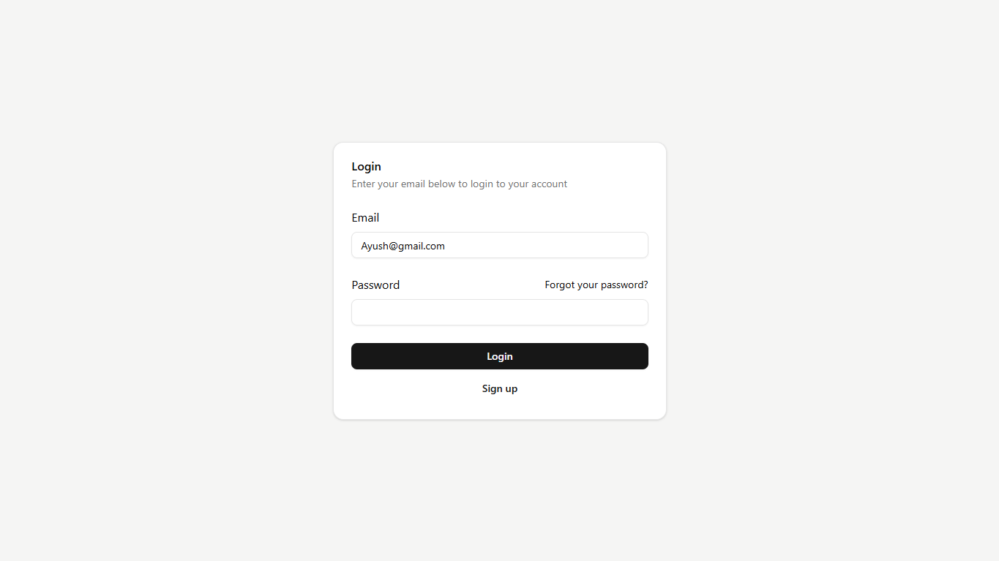
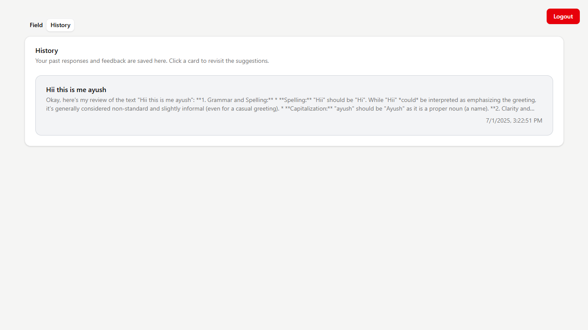
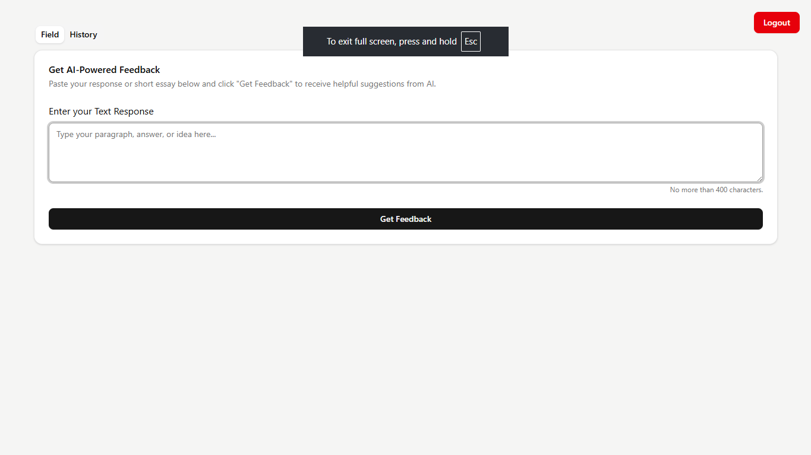

# Feedback App Frontend

Build with React + TypeScript + Gemini API

```bash
# clone repo
git clone https://github.com/Ayush-may/feedback-app-frontend.git

cd feedback-app-frontend

# run
npm install
npm run dev
```

# .env
use this variable and add your data

```bash
  VITE_API_URL=http://localhost:5000/api
```

# Demo






